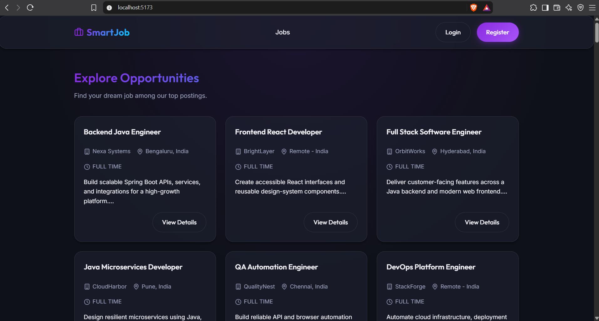

# Smart Job Portal

Smart Job Portal is a full-stack recruitment platform for students, recruiters, and administrators. Students can discover jobs, upload resumes, receive resume insights, and apply to roles. Recruiters can publish jobs, manage applications, and rank candidates. Administrators can manage users, jobs, and applications.

## Screenshots

### Job Dashboard



### Sign In and Sign Up


### Resume Uploader


### Applied Jobs


## Main Features

### Students and job seekers

- Browse active job offers across technology, finance, healthcare, education, operations, design, sales, and other domains.
- View job details, company, location, job type, and description.
- Upload or replace a PDF resume.
- Extract resume skills, education, and experience sections with Apache PDFBox.
- Receive optional Google Gemini resume summary, strengths, and improvement recommendations through Spring AI.
- Upload a resume directly from the application form when applying for the first time.
- Apply with an optional cover letter.
- View application history and interview status.

### Recruiters

- Create, edit, activate, and delete job postings.
- View jobs owned by the recruiter.
- Review applicants and their resumes.
- Shortlist candidates and schedule interviews with meeting links and notes.
- View candidate rankings based on Gemini screening when configured, with local keyword matching as a fallback.

### Administrators

- View dashboard statistics.
- Manage users and roles.
- Review all jobs.
- Review all applications.
- Access admin routes after signing in with an `ADMIN` account.

## Technology Used

### Backend

- Java 17+ and Spring Boot 3.2.0
- Spring Web and REST controllers
- Spring Security with JWT authentication
- Spring Data JPA and Hibernate
- Flyway database migrations and seed data
- MySQL for persistent environments
- H2 for local development and testing
- Apache PDFBox for PDF resume text extraction
- Spring AI 1.1.0 with Google Gemini GenAI
- Jackson for JSON serialization and structured AI responses
- Maven Wrapper for repeatable builds

### Frontend

- React 19
- Vite
- React Router
- Axios
- Lucide React icons
- CSS with the existing Smart Job Portal theme

### Integrations

- AWS S3-compatible resume storage configuration
- Optional email notifications for applications and interviews
- Vite development proxy from `/api` to the backend at port `8081`

## Prerequisites

Install the following before running the project:

- Java 17 or newer
- Node.js 18 or newer and npm
- Git, if cloning the repository
- MySQL 8 or newer for persistent database mode
- A Google Gemini API key from Google AI Studio for AI-assisted screening; this is optional
- AWS credentials only if you want to store resumes in S3

Check the installed tools:

```powershell
java -version
node --version
npm --version
```

## Quick Start with H2

H2 is the easiest way to run the complete application locally. It does not require MySQL.

### 1. Start the backend

From the repository root:

```powershell
$env:APP_BOOTSTRAP_ADMIN_EMAIL="admin@smartjobportal.com"
$env:APP_BOOTSTRAP_ADMIN_PASSWORD="ChangeMe123!"
$env:APP_BOOTSTRAP_ADMIN_FULL_NAME="System Admin"

cd backend
.\mvnw.cmd "-Dspring-boot.run.profiles=dev" spring-boot:run
```

The backend runs at `http://localhost:8081`.

Flyway automatically:

- Creates the application tables.
- Adds resume AI insight columns.
- Repairs identity sequences after seeded IDs.
- Seeds one demo recruiter and 100 job offers.
- Creates the first admin account when the bootstrap variables are set.

### 2. Start the frontend

Open a second terminal at the repository root:

```powershell
cd frontend
npm install
npm run dev
```

Open `http://localhost:5173` in your browser.

The frontend proxies `/api` requests to `http://localhost:8081`.

## MySQL Setup

Use MySQL when you need data to persist between backend restarts.

### 1. Create the database

```sql
CREATE DATABASE IF NOT EXISTS smart_job_portal;
```

### 2. Configure the backend

Update `backend/src/main/resources/application.properties` with your local MySQL credentials. Do not commit real passwords or API keys.

```properties
spring.datasource.url=jdbc:mysql://localhost:3306/smart_job_portal?createDatabaseIfNotExist=true&useSSL=false&serverTimezone=UTC&allowPublicKeyRetrieval=true
spring.datasource.username=root
spring.datasource.password=your-mysql-password
```

### 3. Start the backend

```powershell
cd backend
.\mvnw.cmd spring-boot:run
```

The default profile runs on `http://localhost:8081`. Flyway owns schema creation and data migrations; Hibernate validates the schema with `ddl-auto=validate`.

## Configure Gemini AI

Spring AI runs inside the backend. There is no separate AI service to start.

Set the key before starting the backend:

```powershell
$env:GEMINI_API_KEY="your-gemini-api-key"
$env:GEMINI_MODEL="gemini-2.5-flash"
cd backend
.\mvnw.cmd "-Dspring-boot.run.profiles=dev" spring-boot:run
```

Gemini is used for:

- Resume professional summary generation.
- Resume strengths and improvement recommendations.
- Candidate-to-job match scoring.
- Matched skill extraction for recruiter ranking.

If `GEMINI_API_KEY` is not set, the application still runs. Resume parsing uses local PDF extraction, and candidate ranking falls back to keyword matching.

Relevant configuration:

```properties
spring.ai.google.genai.api-key=${GEMINI_API_KEY:local-disabled-key}
spring.ai.google.genai.chat.model=${GEMINI_MODEL:gemini-2.5-flash}
spring.ai.google.genai.chat.temperature=0.1
spring.ai.google.genai.chat.response-mime-type=application/json
```

Never commit a Gemini key to source control. Rotate any key that has been shared publicly.

## Admin Login

Admin registration is intentionally not available from the public sign-up form. Create the first admin through environment variables before starting the backend:

```powershell
$env:APP_BOOTSTRAP_ADMIN_EMAIL="admin@smartjobportal.com"
$env:APP_BOOTSTRAP_ADMIN_PASSWORD="ChangeMe123!"
$env:APP_BOOTSTRAP_ADMIN_FULL_NAME="System Admin"
```

Then open `http://localhost:5173/login` and sign in with those credentials. The bootstrap runs only when no admin exists. Change the example password for real use.

## Useful URLs

| Resource | URL |
| --- | --- |
| Frontend | `http://localhost:5173` |
| Backend root | `http://localhost:8081` |
| Public jobs API | `http://localhost:8081/api/jobs/public` |
| H2 console | `http://localhost:8081/h2-console` |

For H2, use JDBC URL `jdbc:h2:mem:smart_job_portal`, user `sa`, and an empty password.

## Build and Test

### Backend

```powershell
cd backend
.\mvnw.cmd clean test
```

Compile without tests:

```powershell
.\mvnw.cmd clean -DskipTests compile
```

### Frontend

```powershell
cd frontend
npm run lint
npm run build
```

## Project Structure

```text
backend/
  src/main/java/com/smartjobportal/
    config/          Startup and application configuration
    controller/      REST endpoints
    dto/             API request and response objects
    entity/          JPA domain entities
    repository/      Spring Data repositories
    security/        JWT security and authentication
    service/         Business logic, resume parsing, and AI screening
  src/main/resources/
    db/migration/    Flyway schema and seed migrations
    application*.properties

frontend/
  src/
    api/             Axios API clients
    app/             React router
    components/      Shared layout components
    features/        Auth, jobs, resumes, applications, ranking, and admin pages
    styles/          Shared theme styles

screenshots/         README product screenshots
```

## Important Notes

- Run frontend commands from `frontend/`, not the repository root.
- Run Maven commands from `backend/`.
- Resume uploads must be PDF files and are limited to 10 MB.
- A student can apply only once to the same job.
- A resume is required before submitting an application.
- Do not commit database passwords, JWT secrets, AWS credentials, or Gemini API keys.
